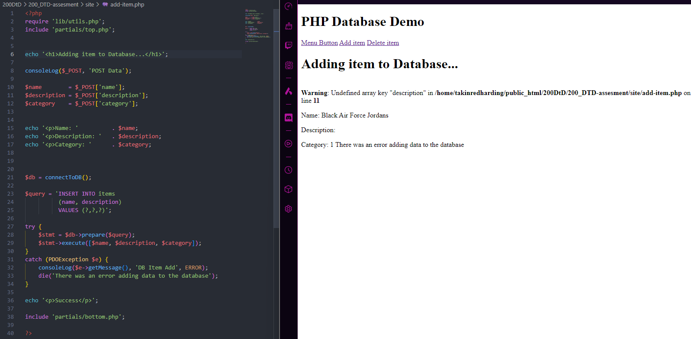
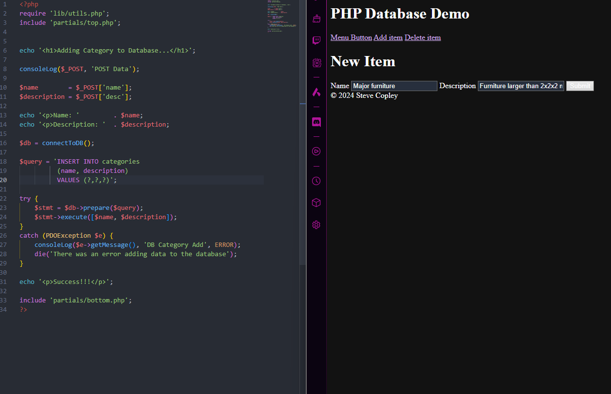
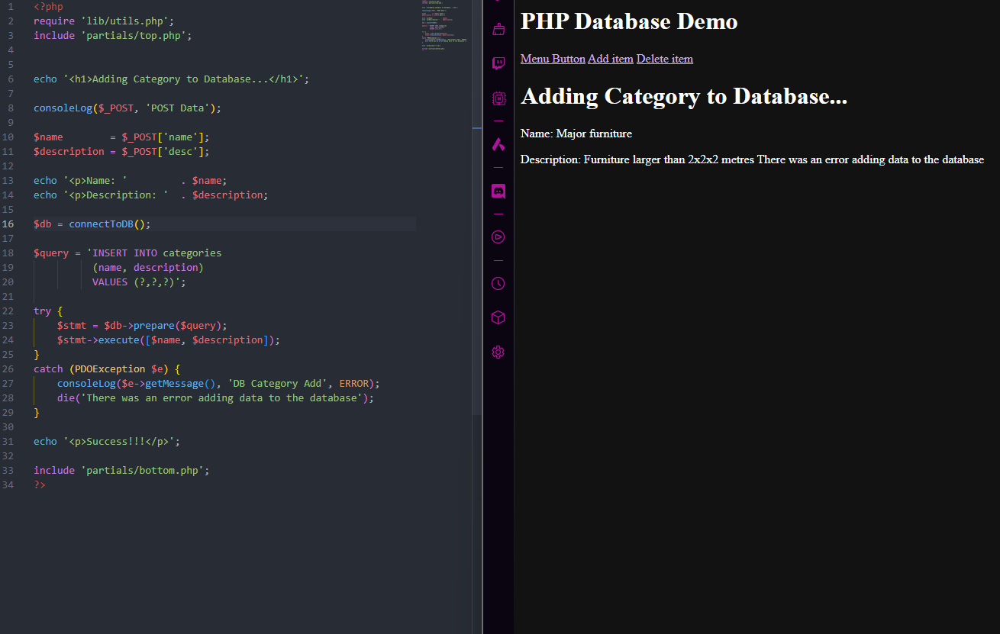
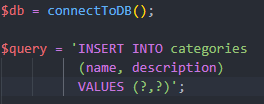
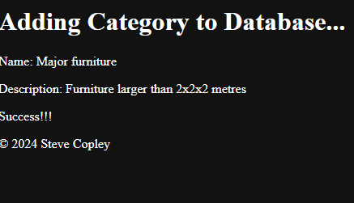

# Database

This is where you will place information about your database:
- Structure
- SQL dump
- etc.

### 08/08/24

working on the adding items to database function

originally, when i tried to add an item to the database, i was shown an 'undefined array key' error on line 11 of add-item.php

### 12/08/24

working on the function to add categories to the database. when i enter this information:

this error shows up;

this can be fixed by removing one of the question marks on line 20:

now the category is added sucsessfully
