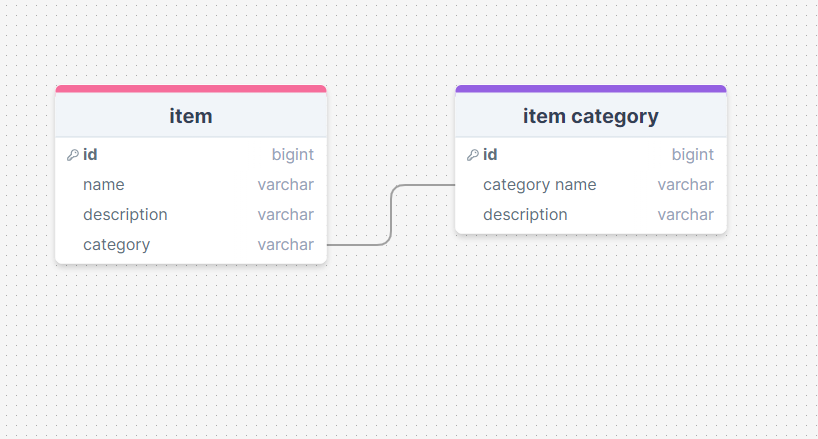
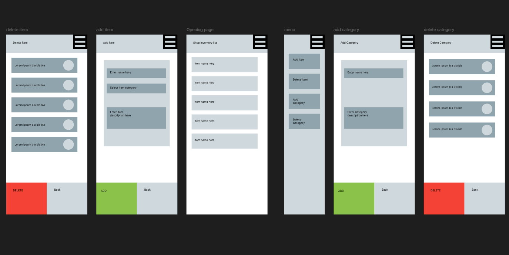
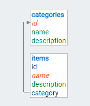
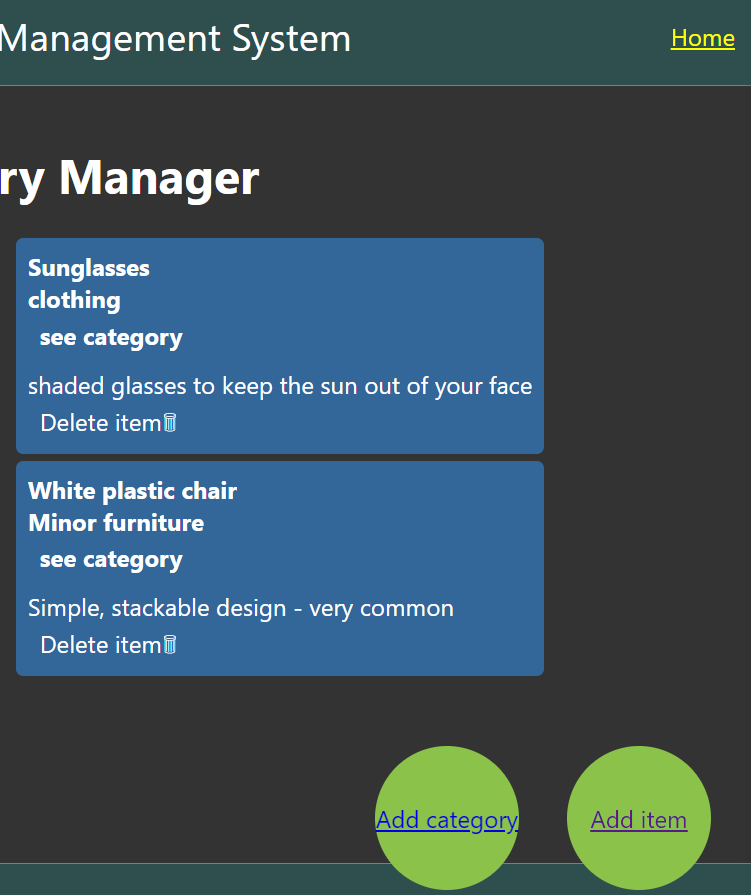
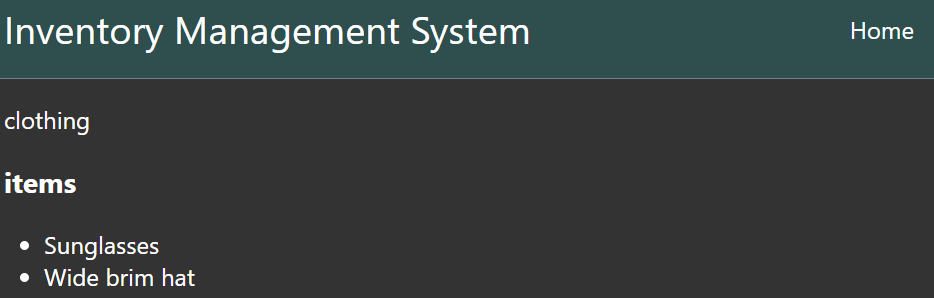
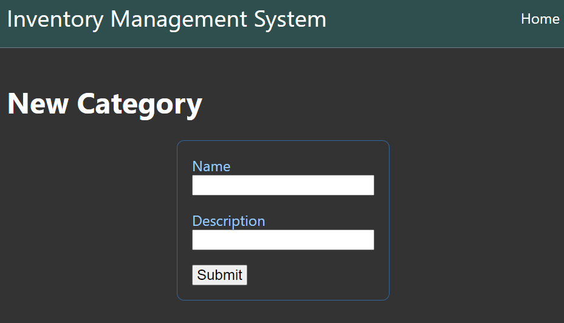
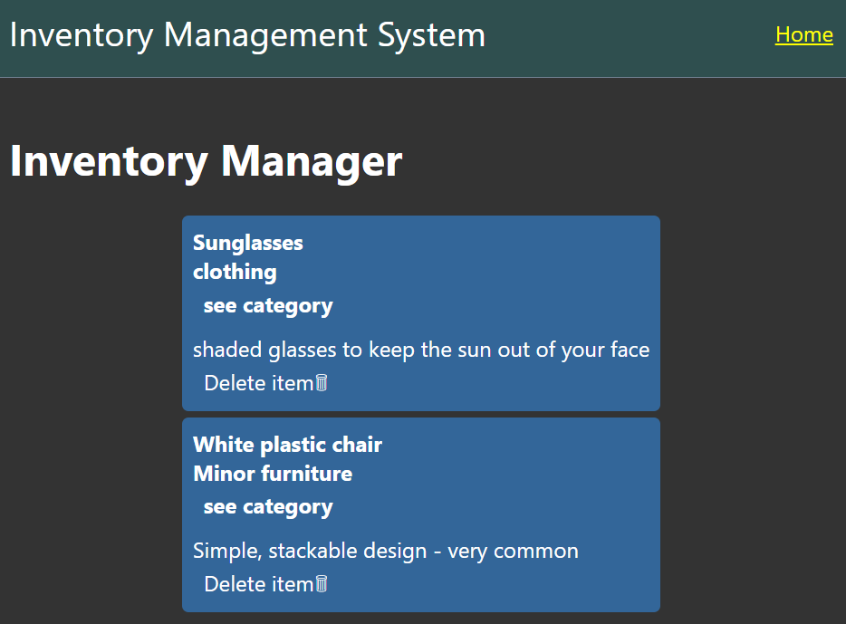

# The Design of a Database-Linked Website for NCEA Level 2

Project Name: **Inventory Listing System**

Project Author: **Torrian Kinred-Harding**

Assessment Standards: **91892** and **91893**

-------------------------------------------------

## System Requirements

### Identified Need or Problem

Owners of second-hand stores have a very messy and chaotic inventory by nature, making it hard to know everything they have in store. Having a system that tracked their inventory would decrease the need to browse the store manually.

### End-User Requirements

My end user will only be one person, who has moderate IT skills. Therefore, i will need to make sure that the UI is simple and intuitive to use without any major complexity.

### Proposed Solution

This system will be able to:

* Show a list of items on the main page and their category

* show individual categories and all the items that belong to them

* Add items to the list

* Add categories to the database which new items can be listed under

* Remove items from the list

-------------------------------------------------

## Relevant Implications

### Usability

The usability of a system is how easy/difficult it is for users to make the system do it's intended purpose.

I will need to design my system to be as usable as possible since the main client (the shop owner) of the second-hand shop may not have advanced IT skills. Any customers that use the website could also have a wide range of IT skills. I need to ensure that the system is usable for people, even if they aren’t skilled with IT.

I will make sure that the system is intuitive to understand by removing unnecessary details and making simple basic functions to use the site.

### Aesthetics

The aesthetic implications of a system relate to how it looks in terms of design.

I should include aesthetic considerations when i design the system UI because a pleasantly designed interface is much more enjoyable to use than a badly designed one(clashing colours, etc.). This is especially important because several customers might be using the website, so the appearance has more importance than if it was just the shop owner using the site.

I will need to try and make the website User Interface visually apealling.

### End-users

The end-user implications of a digital technology or digital outcome (e.g. a website) are connected to the specific needs of the end-user(s).

It is very important that i ensure the end product fulfils the shop owner's requirements (being able to digitally record inventory), because that is the entire purpose of the website system.

I will ask the client whether the finished product meets their expectations and requirements.

### Functionality

The functionality implications of a system relate to how well it works for the end-user, in terms of meeting its intended purpose.

I need to make my system work properly, with no major errors or bugs. This is absolutely necessary because a non-functional website cannot be used.

I will make sure my website works as intended, with no major bugs or errors.

-------------------------------------------------
## Final System Design

### Database Structure

Database design here: 

### User Interface Design

Ui design here:

-------------------------------------------------

## Completed System

### Database Structure

Database schema here: 

### User Interface Design

this shows the home page

this shows the category page

this shows adding a category

https://mywaimeaschool-my.sharepoint.com/:v:/g/personal/takinredharding_waimea_school_nz/EVpokPYUOGpEom8TNsSbticBD_BcV4BAnW7tRzED9un9Og?e=xKAwfd&nav=eyJyZWZlcnJhbEluZm8iOnsicmVmZXJyYWxBcHAiOiJTdHJlYW1XZWJBcHAiLCJyZWZlcnJhbFZpZXciOiJTaGFyZURpYWxvZy1MaW5rIiwicmVmZXJyYWxBcHBQbGF0Zm9ybSI6IldlYiIsInJlZmVycmFsTW9kZSI6InZpZXcifX0%3D

in this, an item is made in multiple categories, a category page is shown, an item is deleted, and a category is added

-------------------------------------------------

## Review and Evaluation

### Meeting the Needs of the Users

In general, the site meets the needs of the user. 
Additionally, the system is fairly simple to use, which suits the IT skill of the client.

### Meeting the System Requirements

In general, the requirements defined at the start of the project were fulfilled reasonably well.

My proposed list of functionalities
Show a list of items on the main page and their category. This was done fairly well; the description is aslo visible, making it better than just having the name

show individual categories and all the items that belong to them. This can be done by pressing 'see category' on each item's box. This method of seeing categories is not ideal, because there might be categories that do not have items assigned to them, meaning they cannot be seen outside of  the 'add item' page.

Add items to the list. this works as intended

Add categories to the database which new items can be listed under. this also works as intended.

Remove items from the list. This is done by pressing the 'Delete item🗑' button on the item box. the deletion is easy and quick, but this in itself is not entirely a good thing. the client could accidentally delete a item they did not intend to because there is no prompt or confirmation message.

### Review of End-Users

In the end, the site did meet the needs of the client. The site can: Show a list of items on the main page and their category, show individual categories and all the items that belong to them, add items to the list, add categories to the database which new items can be listed under, and remove items from the list. The needs of the user have been met. 

This image shows a list of items and the category they belong to, as well as the ability to delete items 

### Review of Aesthetics

In the final product, this relevant implication was ignored to a degree. This is because the client decided that they would be the only one to use the site, meaning that aesthetics were less important because no customers would be seeing the site.! [picture of site appearance here](images/uipicture.png)

### Review of Usability

In terms of usability, the site is mostly simple and intuitive to understand. Buttons do what people would expect them to do, and so on.

This picture shows the home button in the top right corner, and the items in the middle of the page. Pressing 'see category' brings you to a list of every item in that category, and pressing 'delete item' does exactly that. [Ui picture](images/uipicture.png)
