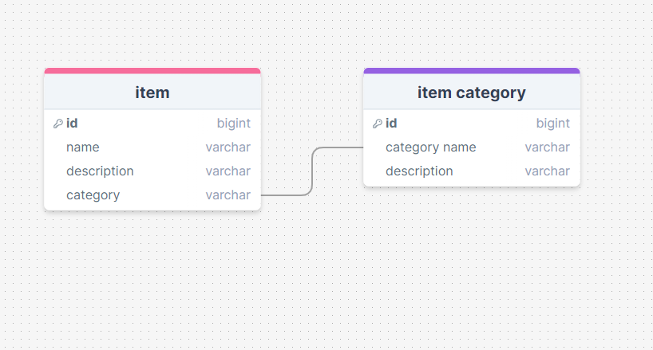

# Development of a Database-Linked Website for NCEA Level 2

Project Name: **Inventory Listing System**

Project Author: **Torrian Kinred-Harding**

Assessment Standards: **91892** and **91893**

-------------------------------------------------

## Design, Development and Testing Log

### 21/05/24

Making a flow diagram for the website in 'Excalidraw' 

#### update (13/06/24)

met with the Client and they said 'i don't intend for the public to use this, so you can remove the admin sign-in. i would also like for a menu and the option to add or remove item categories'

i made a updated version of the ui flow to meet the client's specifications:

### 23/05/24

making a mock-up of the ui in 'Figma'

added button functionality

#### update (13/06/24)

met with the Client and they said 'since you're updating the 'flow' of the UI, i obviously also want you to include all the changes in the mock-up'

i made a updated version of the UI to meet client's requests:

video showing mock-up in action here:

<video src="videos/Ui demo.mp4" controls title="Title"></video>

added colour to UI mock-up

client feedback pending

### 13/06/24

finished database design

### DATE HERE

Replace this test with what you are working on

Replace this text with brief notes describing what you worked on, any decisions you made, any changes to designs, etc. Add screenshots / links to other media to illustrate your notes where necessary.

### DATE HERE

Replace this test with what you are working on

Replace this text with brief notes describing what you worked on, any decisions you made, any changes to designs, etc. Add screenshots / links to other media to illustrate your notes where necessary.